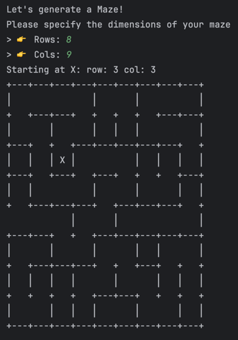

# Maze [⚠️WIP]
Amaze maze
## Vision
- [x] Generate Maze
- [ ] Add levels—How can I increase the complexity of the maze?
- [ ] Make this a web app
- [ ] In a web app, allow the user to have a position:
  - Time the game
  - Calculate the number of moves
  - Calculate the shortest path and display the number of moves
- [ ] Maybe I can store the user information in a relational DB and track their progress
- [ ] Create geo spacial mazes using open street map?
- [ ] Possible ar game?

## Methods
- Aldous Broder
  - 

### **Example grid:**

## References
- https://healeycodes.com/generating-mazes
- https://en.wikipedia.org/wiki/Maze_generation_algorithm